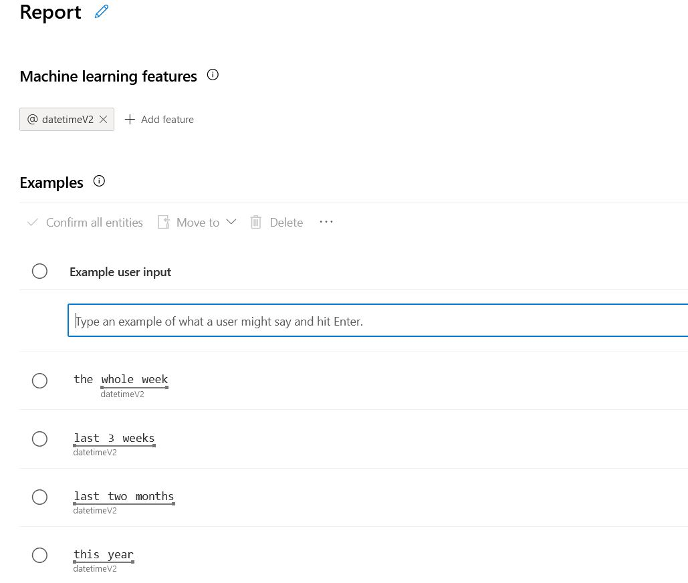

# Clockify NLP Bot

**Clockify NLP Bot** is a [Bot Framework](https://dev.botframework.com) bot developed to act as a timesheet assistant for the busy and the lazy among us.
It reminds proactively people to fill in their time when EOD approaches, and it accepts natural language for creating time entries directly from chat.

It's easy!


## How to use it
It's simple, just open a chat with the bot either on Teams or Telegram.

👉 [Chat on Telegram](http://t.me/clockify_telegram_bot)  
👉 [Chat on Teams](https://teams.microsoft.com/l/chat/0/0?users=28:d7dfef09-5ad7-4e1c-ac47-a3899bf1964c)


## Features:

**Proactive reminders**
It will assist you to complete your due diligence. If you have less than a predefined percentage (75% default) of the working 
hours you have defined (8h default) reported on your Clockify (no matter how you put them in) it sends you a reminder.
You can choose whether to remind a user for today or for yesterdays timesheet. 

**Setting working hours**
A user can set his working hours by himself just writing to the bot. 

**Adding time entries with ease**
Add your time flexibly, even indicating projects partially. For example, you can type
`time bot` instead of `time_survey_bot`. If it's not ambiguous, it'll figure it out.

**Smart task request**
Some projects benefit from tasks drill down, some don't. If you never use them on the project, 
it doesn't ask it in the first place.

## Architecture

This bot is hosted by [xtream](https://xtreamers.io/?utm_source=github&utm_medium=readme&utm_campaign=clockify_bot) on Azure Cloud.
This is what it looks like:


## Support

This project was started as an internal tool for our employees, and then we decided to roll it out
to anyone who could benefit from it, with a few tweaks and adjustments. Hence, we'd do our best to work on any issue 
or bug but do consider we're maintaining it on our spare time.

If you'd like to see this project grow in features, richness and support, you can give a ⭐️ to let us know this is helpful. 
You can also buy us a coffee if you like.

[](https://ko-fi.com/R6R267IDP)

## Installing

If you want to host the bot yourself, you'll need to provide for the other components of the architecture on your own.  
The following are minimal instructions for installing and deploying the bot on App Service.

### Prerequisites

- [.NET Core SDK](https://dotnet.microsoft.com/download) version 3.1
```bash
# determine dotnet version
dotnet --version
```

### To run this bot

Make sure to provide required configuration values. The app currently needs a value for these properties within you appsettings.json:

```json
{
  "LuisAppId": "",
  "LuisAPIKey": "",
  "LuisAPIHostName": "",
  "ProactiveBotApiKey": "",
  "KeyVaultName": "",
  "MicrosoftAppType": "MultiTenant",
  "MicrosoftAppId": "",
  "MicrosoftAppPassword": "",
  "BlobStorage": {
    "DataConnectionString": "",
    "ContainerName": ""
  }
}
```

Description: 
* LuisAppID: AppId for the app you created within luis.ai
* LuisAPIKey: API Key you set for your LUIS service under portal.azure.com
* LuisAPIHostName: Hostname from portal.azure.com without https://!
* ProactiveBotApiKey: The API Key you need to trigger https://<yourbot>:3978/api/timesheet/remind (pass the API-Key as header info "ProactiveBotApiKey")
* MicrosoftAppType: Should be MultiTenant or SingleTenant
* MicrosoftAppId: The AppId of your WebApplication you get from portal.azure.com
* MicrosoftAppPassword: The password for your application. You also get this from portal.azure.com
* KeyVaultName: the name of your Vault storage for storing the tokens
* BlobStorage: The Storage you will use for storing the user profiles

Important: if you test the bot locally, you should use a reduced set of settings: 

```json
{
  "LuisAppId": "",
  "LuisAPIKey": "",
  "LuisAPIHostName": "",
  "ProactiveBotApiKey": "",
  "BlobStorage": {
    "DataConnectionString": "",
    "ContainerName": ""
  }
}
```
You still need the LUIS service to be active.

#### Optional settings
The bot supports these optional settings.

```json
{
  "DEFAULT_WORKING_HOURS": "",
  "MINIMUM_HOURS_FILLED_PERCENTAGE": ""
}
```

* DEFAULT_WORKING_HOURS: Defines the usual working hours per day
* MINIMUM_HOURS_FILLED_PERCENTAGE: Defines how much a user must fill per day to not get reminded

If nothing is defined, the bot will use 75% and 8h which leads to a minimum of 6 hours to be reported.

### KeyVault

The KeyVault also needs configuration of environment variables. These variables must be seti within your WebApplication environment settings. 

Go to AzurePortal->WebApplication->Configuration
```json
{
  "AZURE_CLIENT_ID": "",
  "AZURE_TENANT_ID": "",
  "AZURE_CLIENT_SECRET": ""
}
```
* AZURE_CLIENT_ID: The ID of the principal user (could be for example the APP ID)
* AZURE_TENANT_ID: The ID of the tenant (could be the tenand ID of your APP)
* AZURE_CLIENT_SECRET: The secret for your CLIENT_ID

Important! Make sure that your CLIENT_ID has access to your KeyVault. You grant access within the azure portal under your KeyVault. 
Go to "AccessPolicies" and add a new one. You can choose your APP Registration for example. 


### LUIS
For proper operation, you must provide a LUIS model. This can be done at luis.ai

#### Intents
You must create different intents. The intents below are the ones that i've figured out to be the minimum. 
Add also @datetimeV2 as a feature. 




List of intents: 
* Fill (Example: plus 1 hour on test)
* Report (Example: Last two month or today)
* SetWorkingHours (Example: Change my work hours to 8 hours)
* Utilities_Stop (stop reminding me)

#### Entities
You need also at least one additional entity called "WorkedEntity". This stores the project you have worked on. 


### Commands

The bot understands different commands: 
* logout / log out -> removes the clockify token from the user profile and also from the KeyVault

### Auto reminder

The auto reminder is triggered by an endpoint. You have to call [GET] http://localhost:3978/api/timesheet/remind and pass ProactiveBotApiKey within the header and pass as value the "ProactiveBotApiKey" value. 
There are additional parameters possible to pass: 

* ?type: possible values: today, yesterday -> defines whether you want to remind the user to the todays timesheet or the one from yesterday
* ?respectWorkingHours: possible values: true, false -> defines whether you want to remind the user even outside of the defined working hours.

Example: .../api/timesheet/remind?type=today&respectWorkingHours=false

### Clockify
The first time you contact the bot, he will ask you for your clockify API-Key and stores it within the KeyVault. 

### Run

Then run the bot. For example, from a terminal:

```bash
# run the bot
dotnet run
```

### Integration testing setup

- Create a Clockify account and generate an API key
- Create a `test.runsettings` file with the following env variables

```xml
<?xml version="1.0" encoding="utf-8"?>
<RunSettings>
    <RunConfiguration>
        <EnvironmentVariables>
            <CLOCKIFY_API_KEY><!--API-KEY--></CLOCKIFY_API_KEY>
            <CLOCKIFY_WS_ID><!--ACTIVE-WORKSPACE-ID--></CLOCKIFY_WS_ID>
        </EnvironmentVariables>
    </RunConfiguration>
</RunSettings>
```
- Configure the Test Runner to use the custom settings

### Testing the bot using Bot Framework Emulator

[Bot Framework Emulator](https://github.com/microsoft/botframework-emulator) is a desktop application that allows bot developers to test and debug their bots on localhost or running remotely through a tunnel.

- Install the Bot Framework Emulator version 4.9.0 or greater from [here](https://github.com/Microsoft/BotFramework-Emulator/releases)

#### Connect to the bot using Bot Framework Emulator

- Launch Bot Framework Emulator
- File -> Open Bot
- Enter a Bot URL of `http://localhost:3978/api/messages`

### Deploy the bot to Azure

Basically, you need to do the following: 
* Create a resource group
* Create a service plan (for your web apps, choose windows as platform)
* Create a new Azure Bot (choose MultiTenant and Create new Microsoft App ID)
* Create a new KeyVault
* Create a new StorageAccount
* Create a new container within your StorageAccount
* Create a new LUIS service (together with authoring)
* Go to luis.ai and create a new LUIS app connected to your previously created LUIS service
* Create the luis.ai model at luis.ai
* Go to your bot instance within your resource group and connect the desired channels
* Go to your KeyVault and grant access to it for your WebApp registration
* Copy all required information for the appsettings.json and for the WebApp env vars.
* Set all the variables accordingly
* Within your IDE, publish your bot to your azure webapp (you can also download the publish profile from the azure portal)

To learn more about deploying a bot to Azure, see [Deploy your bot to Azure](https://aka.ms/azuredeployment) for a complete list of deployment instructions.

## Further reading

- [Bot Framework Documentation](https://docs.botframework.com)
- [Azure Bot Service Introduction](https://docs.microsoft.com/azure/bot-service/bot-service-overview-introduction?view=azure-bot-service-4.0)
- [Language Understanding using LUIS](https://docs.microsoft.com/en-us/azure/cognitive-services/luis/)

# Who we are

A proudly 🇮🇹 software development and data science startup.<br>We consider ourselves a family of talented and passionate people building their own products and powerful solutions for our clients. Get to know us more on <a target="_blank" href="https://xtreamers.io">xtreamers.io</a> or follow us on <a target="_blank" href="https://it.linkedin.com/company/xtream-srl">LinkedIn</a>.


